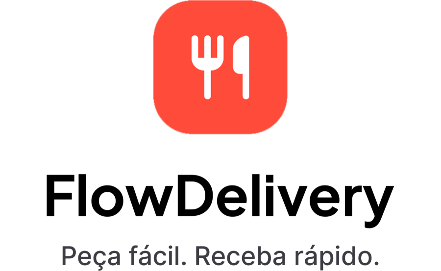
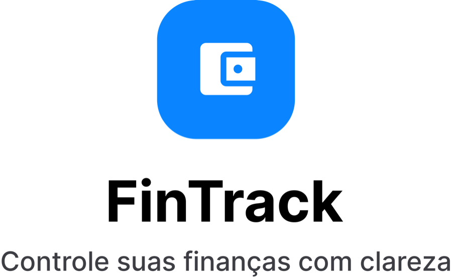
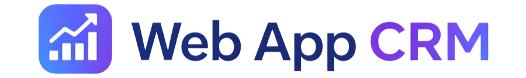

 

# Leonardo de Moraes Souza  
## Mobile Software Engineer | Flutter • Dart • Swift • SwiftUI

### Desenvolvo aplicações móveis escaláveis com arquitetura limpa, interfaces orientadas a estado, testes automatizados e integração com backends reais.
 

Sou Desenvolvedor de Software com foco em aplicações Mobile, Web e iOS,
utilizando Flutter, Dart, Swift e SwiftUI.

Construo projetos com Clean Architecture, MVVM, gerenciamento de estado
reativo, Design Systems, testes automatizados e integração com Firebase
e Supabase.

Atualmente desenvolvo o MediFlow e o FlowDelivery em duas implementações:

Flutter: aplicação multiplataforma com Riverpod, GoRouter e Supabase.

iOS nativo: aplicação em SwiftUI com NavigationStack, Design Tokens, XCTest, SwiftLint e SwiftFormat.

---

## 🧩 Projetos em Destaque

---
<table>
<tr>
<td width="90" valign="top" align="center">
 

</td>
<td valign="top">

- [**MediFlow**](https://github.com/leomoraesitu/mediflow-learning)  
  Projeto desenvolvido em **Flutter e Dart** para demonstrar a construção incremental de um checkout de medicamentos resiliente, com fluxo orientado a estados, acessibilidade e testes automatizados.

  Estruturado como monorepo com **Pub Workspaces**, separa a aplicação mobile de um domínio Dart puro. O projeto aplica **BLoC/Cubit, máquina de estados, Repository Pattern, injeção de dependência, imutabilidade e ciclos TDD RED → GREEN**.

  Projeto voltado para evidenciar fundamentos de **arquitetura mobile, gerenciamento reativo de estado, regras de domínio, recuperação de falhas, Design System, acessibilidade, documentação técnica e evolução orientada por Pull Requests**.

  > Todos os dados, medicamentos, receitas, saldos e pagamentos utilizados são exclusivamente fictícios.

</td>
</tr>
<tr>
<td width="90" valign="top" align="center">
   
<picture>
  <source media="(prefers-color-scheme: dark)" srcset="assets/flowdelivery-dark.png">
  
</picture>
</td>
<td valign="top">

-   [**FlowDelivery**](https://github.com/leomoraesitu/flowdelivery-app)  
  Aplicativo de delivery desenvolvido em **Flutter**, estruturado como case de portfólio para demonstrar arquitetura MVVM, organização por features, design system, documentação técnica e preparação para integração com Supabase.  
  Projeto voltado para evidenciar fundamentos de **engenharia de software, arquitetura mobile, UX/UI Design, versionamento, gestão ágil e evolução incremental de produto digital**.

    🌐 [Versão Web](https://leomoraesitu.github.io/flowdelivery-app/)    
    📱 [Versão Android](https://github.com/leomoraesitu/flowdelivery-app/releases)

-   [**FlowDelivery iOS**](https://github.com/leomoraesitu/flowdelivery-ios)  
  Implementação nativa para iOS do ecossistema FlowDelivery, desenvolvida com Swift e SwiftUI para aprofundamento em Engenharia Mobile no ecossistema Apple.

Principais fundamentos aplicados:
- Swift e SwiftUI
- NavigationStack e rotas tipadas
- Interface orientada a estado
- Design System com Design Tokens
- Componentes reutilizáveis
- XCTest e UI Tests
- SwiftLint e SwiftFormat
- Xcode e Swift Package Manager
- Feature branches e Pull Requests

</td>
</tr>
<tr>
<td width="90" valign="top" align="center">
   
<picture>
  <source media="(prefers-color-scheme: dark)" srcset="assets/fintrack-dark.png">
  
</picture>
</td>
<td valign="top">

-  [**FinTrack**](https://github.com/leomoraesitu/fintrack)  
  Aplicativo de finanças pessoais em **Flutter**, estruturado como case de portfólio para demonstrar visão de produto, arquitetura em camadas, organização de backlog, documentação técnica e handoff de UX/UI para implementação do MVP.  
  Projeto voltado para evidenciar fundamentos de **engenharia de software, clean code, gestão ágil, documentação funcional e preparação de produto digital**.
   
    📱 [Versão Android](https://github.com/leomoraesitu/fintrack/releases)    

</td>
</tr>
<tr>
<td width="90" valign="top" align="center">
<picture>
  <source media="(prefers-color-scheme: dark)" srcset="assets/webappcrm-dark.png">
  
</picture>
</td>
<td valign="top">

- [**Web App CRM**](https://github.com/leomoraesitu/web-app-crm)  
  Aplicação web de gestão de clientes (CRM) desenvolvido em **FlutterFlow + Firebase**, com foco em organização de leads, controle de informações comerciais e estruturação de fluxo de atendimento.  
  Projeto voltado para demonstrar fundamentos de **arquitetura web, modelagem de dados, governança, gestão de projetos, organização de estados e boas práticas de versionamento**.
  
  🌐 [Versão Web](https://webappcrm-leomoraesitu.flutterflow.app/)    
  📱 [Versão Android](https://github.com/leomoraesitu/web-app-crm/releases)

</td>
</tr>
<tr>
<td width="90" valign="top" align="center">
   

</td>
<td valign="top">

- [**App Viagens**](https://github.com/leomoraesitu/app-viagens)  
  Aplicativo de viagens desenvolvido em **FlutterFlow + Firebase**, com CRUD de destinos, favoritos e design responsivo focado em UX e usabilidade.  

  🌐 [Versão Web](https://app-viagens-leomoraes.flutterflow.app)   
  📱 [Versão Android](https://github.com/leomoraesitu/app-viagens/releases)

</td>
</tr>
</table>

---

## 💼 Tecnologias e Ferramentas

### Stack principal

Flutter · Dart · Swift · SwiftUI · BLoC · Riverpod · GoRouter  
Supabase · Firebase · PostgreSQL  
Xcode · XCTest · SwiftLint · SwiftFormat  
Git · GitHub · GitHub Actions · CI/CD

Stack técnica utilizada em meus projetos e estudos de desenvolvimento de software.

---

## Como trabalho

Clean Architecture e separação de responsabilidades /
Desenvolvimento incremental orientado por sprints /
Spec-Driven Development /
Conventional Commits e Pull Requests /
Testes automatizados e evidências de validação /
CI/CD e documentação técnica
  
Experiência em práticas ágeis para planejamento, acompanhamento e entrega contínua de projetos.

---

## 📈 Estatísticas

  
  
   

---

## Sobre

- Desenvolvedor de Software com experiência profissional em Flutter, FlutterFlow, Dart e Supabase.
- Formado em Análise e Desenvolvimento de Sistemas pela FATEC Itu.
- Em evolução no desenvolvimento iOS nativo com Swift e SwiftUI.
- Interesse em Arquitetura Mobile, Design Systems, qualidade de código, automação e experiência do usuário.
- Experiência anterior em audiovisual, contribuindo para comunicação, percepção visual e atenção aos detalhes.
---

## 🌐 Conecte-se Comigo

---

  
🚀 _“Criar soluções que inspiram, transformam e geram impacto real.”_  
📍 Desenvolvido por **Léo Moraes**

